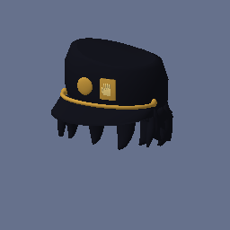

<h1 align="center">PEAK × JOJO — Scout Hats</h1>

Six JoJos. One very bizarre climb.

<a href="https://github.com/Rachel560lu/peak-jojo-hats/releases/latest">Download v0.4.2</a> · <a href="README.zh-CN.md">简体中文</a> · <a href="docs/INSTALL.md">Installation</a> · <a href="https://github.com/Rachel560lu/peak-jojo-hats/issues">Report an issue</a>

A fan-made, hat-only cosmetic mod for **PEAK**, bringing six JOJO-inspired hairstyles and a cap to your scout. Rounded, stylized meshes, a shared color palette, and recognizable silhouettes made for a bizarre climb with friends.

> **Heads only.** The eyes, expressions, outfits and props in these gameplay screenshots are not added by this mod. It supplies six static head-slot cosmetics—no abilities, body replacements or hair physics.

## In-game gallery

These are actual gameplay screenshots. Click any image to see the original full-size picture.

<table>
<tr><th>Jonathan Joestar</th><th>Joseph Joestar</th><th>Jotaro Kujo</th></tr>
<tr>
<td></td>
<td></td>
<td></td>
</tr>
<tr><th>Josuke Higashikata</th><th>Giorno Giovanna</th><th>Jolyne Cujoh</th></tr>
<tr>
<td></td>
<td></td>
<td></td>
</tr>
</table>

## What's included

- Six selectable hats: Jotaro Cap, Josuke Pompadour, Giorno Rolls, Jonathan Hair, Jolyne Buns and Joseph Hair.
- Continuous hair volumes, fitted roots and authored smooth normals, with a deliberately simple PEAK-friendly finish.
- Runtime meshes and editable OBJ models. No Unity Editor or Blender is needed to **play** the mod.
- BepInEx + More Customizations integration; the cosmetics appear in the passport's Hat tab.

## Install

1. Create a **dedicated PEAK profile** in r2modman or Thunderstore Mod Manager.
2. Install `BepInEx-BepInExPack_PEAK-5.4.75301` and `cretapark-More_Customizations-1.1.10` (the tested dependency versions).
3. Download [JojoScoutHats-0.4.2.zip](https://github.com/Rachel560lu/peak-jojo-hats/releases/download/v0.4.2/JojoScoutHats-0.4.2.zip). Import it as a local mod, or copy its `BepInEx/plugins/JojoHats` folder into your profile's `BepInEx/plugins` folder.
4. For the JOJO-only, zero-`.pcab` setup, close PEAK and run the included compatibility installer as explained in [the installation guide](docs/INSTALL.md). It backs up and patches the **local** More Customizations DLL and moves its sample bundle out of the loading path.
5. Launch modded PEAK, open the passport's Hat tab, and page to the six JOJO icons.

**Do not just delete `built-in.pcab`.** Unmodified More Customizations 1.1.10 rejects an empty bundle list; the compatibility step is required for this zero-bundle setup.

### Compatibility notes

- This version intentionally replaces the **custom** cosmetic catalog with these six hats. Other custom hats, eyes and accessories are excluded; **vanilla cosmetics remain available**. Keep it in a dedicated profile.
- Everyone in a lobby should use matching cosmetic packs and versions. This mod does not transfer mesh files between players; two-client multiplayer validation is still pending.
- Switch to a vanilla hat before uninstalling or launching an unmodded profile.
- Framework updates can restore the sample bundle or change compatibility. Only More Customizations 1.1.10 has been tested with the included patch.
- These are static hats. Clipping with every outfit, first-person camera and climbing/ragdoll pose has not been exhaustively tested.

## Source and development

Current release: **0.4.2**. The repository includes the C# loader, procedural model sources, exported JSON/OBJ meshes, shared palette and the six original-size showcase images.

See [Build and model development](docs/BUILD.md), [validation scope](docs/VALIDATION.md) and [changelog](CHANGELOG.md). Game assemblies and third-party mod DLLs are **not** distributed here; a local PEAK installation is needed to compile the loader.

## Credits and project status

Built on [BepInEx](https://github.com/BepInEx/BepInEx) and [More Customizations](https://github.com/Creta5164/peak-more-customizations). The [More Customizations hat guide](https://github.com/Creta5164/peak-more-customizations/blob/main/docs/hat.md) informed head-slot integration.

This is an unofficial fan project, not affiliated with or endorsed by the creators or rights holders of PEAK or JoJo's Bizarre Adventure. The mod meshes were authored for this project; screenshots contain the game and its existing cosmetics. No explicit reuse license is included yet—please contact the maintainer before reusing project material.
