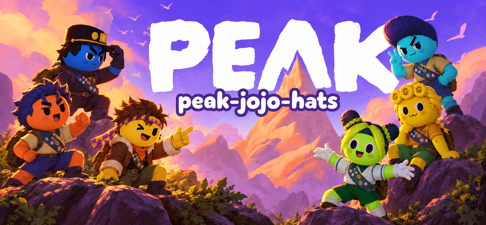
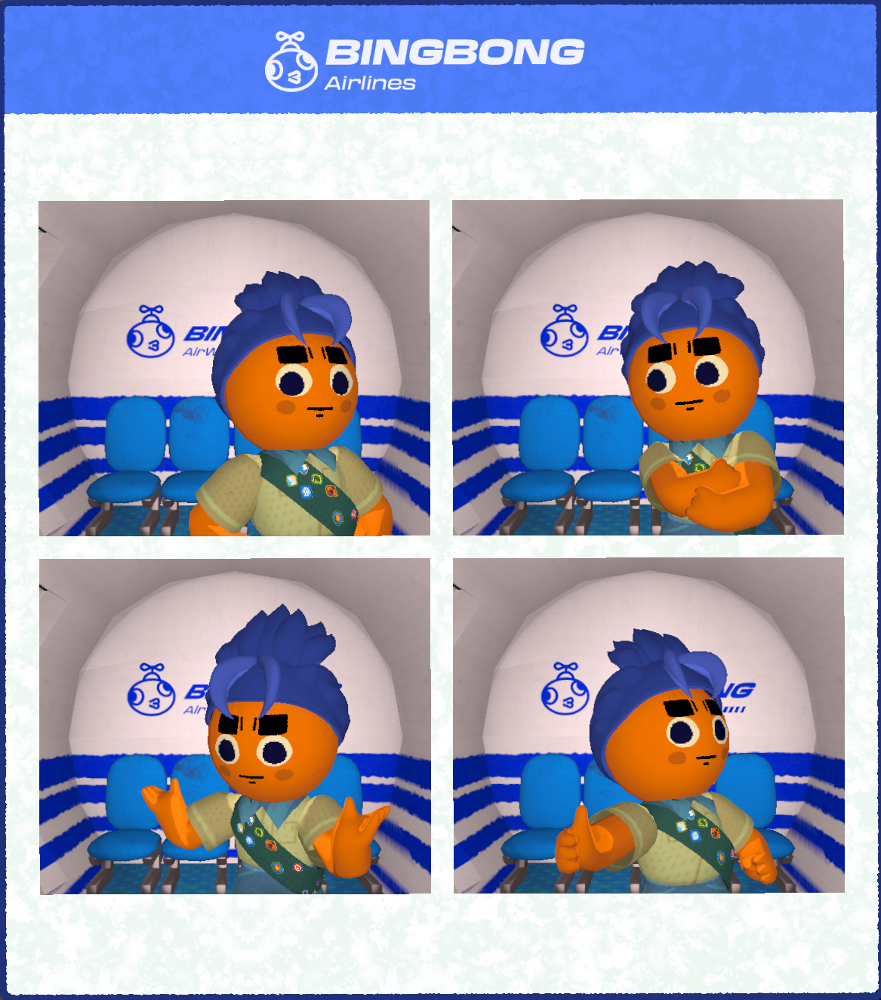
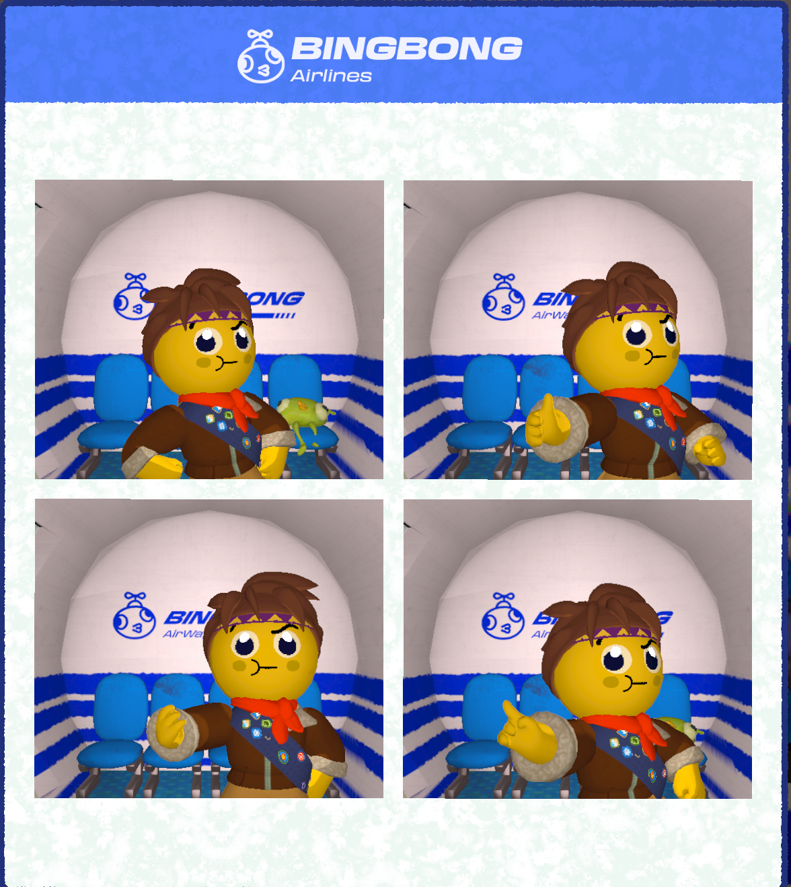
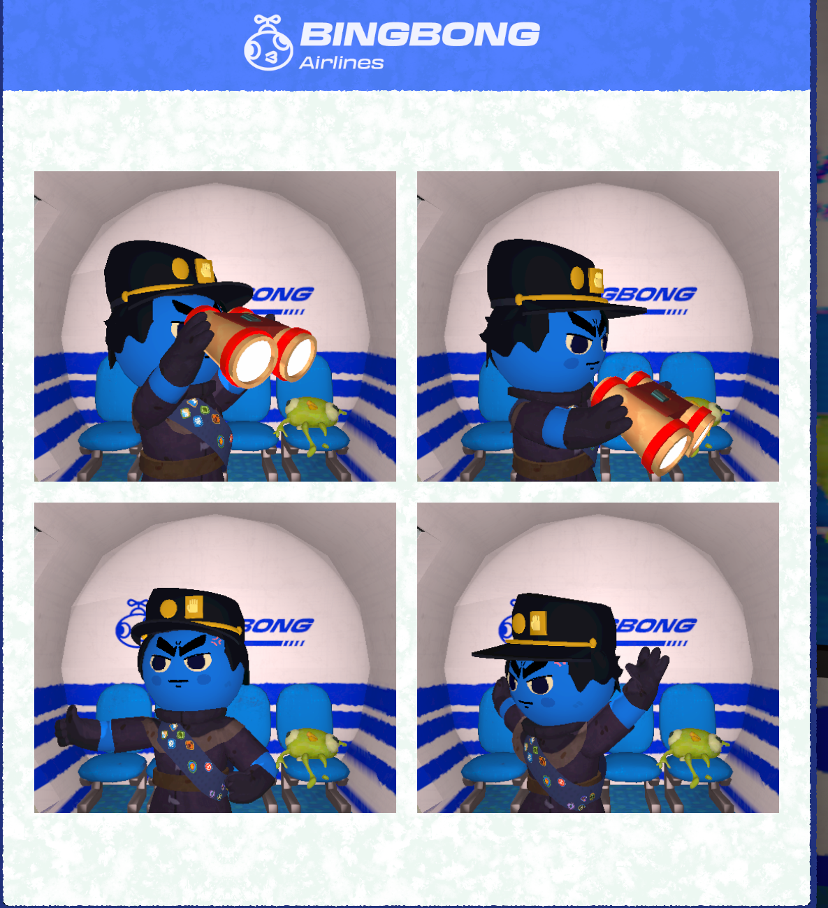
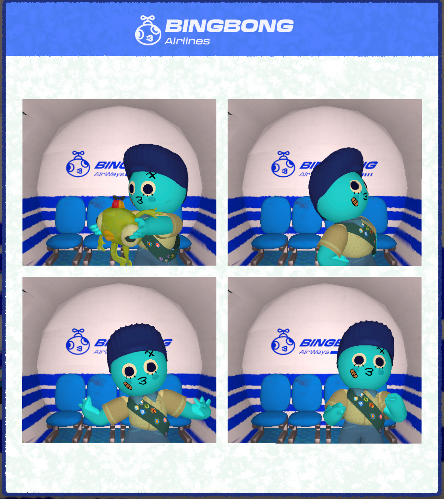
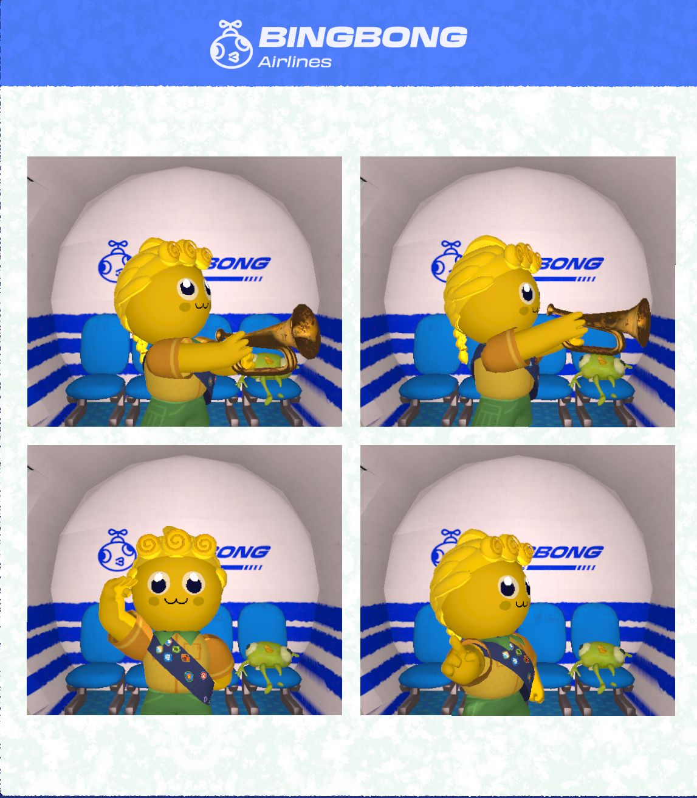
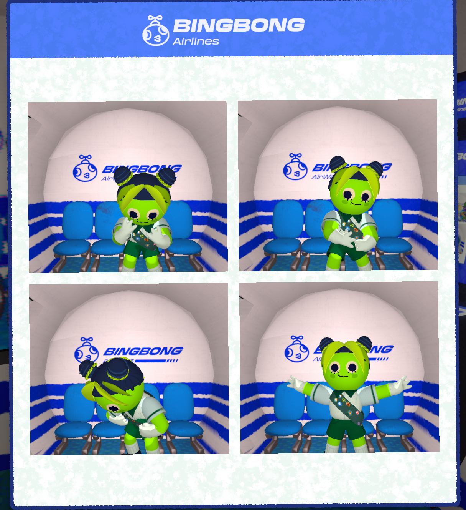

  

<h1 align="center">peak-jojo-hats</h1>

  <strong>JOJO's Bizarre Climb</strong> 
  JOJO-inspired hats and hairstyles for PEAK.

  <strong>JOJO 的奇妙登山</strong> 
  给 PEAK 小人换个 JOJO 发型。

  
  
  
  

  <a href="https://github.com/Rachel560lu/peak-jojo-hats/releases/latest">Download / 下载</a> ·
  <a href="README.zh-CN.md">简体中文</a> ·
  <a href="README.md">English</a> ·
  <a href="docs/INSTALL.md">Install / 安装</a> ·
  <a href="https://github.com/Rachel560lu/peak-jojo-hats/issues">Report an issue / 反馈</a>

A small JOJO fan mod for **PEAK**. Pick from six looks inspired by Jonathan, Joseph, Jotaro, Josuke, Giorno and Jolyne, then head out for a climb. They're all worn as hats, including the hairstyles.

> **Just hats and hair.** The eyes, expressions, outfits and props in the screenshots aren't included. This mod only changes your headwear—no extra abilities, body replacements or moving hair.

## In-game gallery

Here's how they look in-game. Click a photo for a closer look.

<table>
<tr><th>Jonathan Joestar</th><th>Joseph Joestar</th><th>Jotaro Kujo</th></tr>
<tr>
<td></td>
<td></td>
<td></td>
</tr>
<tr><th>Josuke Higashikata</th><th>Giorno Giovanna</th><th>Jolyne Cujoh</th></tr>
<tr>
<td></td>
<td></td>
<td></td>
</tr>
</table>

## What's included

- Six selectable hats: Jotaro Cap, Josuke Pompadour, Giorno Rolls, Jonathan Hair, Jolyne Buns and Joseph Hair.
- Rounded shapes and simple colors to suit PEAK's little scouts.
- Pick your favorite in the passport's Hat tab, with BepInEx and More Customizations installed.
- Want to tinker? Model files are included. You don't need Blender or Unity Editor just to play.

## Install

1. Create a **dedicated PEAK profile** in r2modman or Thunderstore Mod Manager.
2. Install `BepInEx-BepInExPack_PEAK-5.4.75301` and `cretapark-More_Customizations-1.1.10` (the tested dependency versions).
3. Download [JojoScoutHats-0.4.2.zip](https://github.com/Rachel560lu/peak-jojo-hats/releases/download/v0.4.2/JojoScoutHats-0.4.2.zip). Import it as a local mod, or copy its `BepInEx/plugins/JojoHats` folder into your profile's `BepInEx/plugins` folder.
4. For the JOJO-only, zero-`.pcab` setup, close PEAK and run the included compatibility installer as explained in [the installation guide](docs/INSTALL.md). It backs up and patches the **local** More Customizations DLL and moves its sample bundle out of the loading path.
5. Launch modded PEAK, open the passport's Hat tab, and page to the six JOJO icons.

**Please run the compatibility step before removing `built-in.pcab`.** Without the patch, More Customizations 1.1.10 reports an error when no bundles are present.

### Compatibility notes

- This version intentionally replaces the **custom** cosmetic catalog with these six hats. Other custom hats, eyes and accessories are excluded; **vanilla cosmetics remain available**. Keep it in a dedicated profile.
- Everyone in a lobby should use matching cosmetic packs and versions. This mod does not transfer mesh files between players; two-client multiplayer validation is still pending.
- Switch to a vanilla hat before uninstalling or launching an unmodded profile.
- Framework updates can restore the sample bundle or change compatibility. Only More Customizations 1.1.10 has been tested with the included patch.
- These are static hats. Clipping with every outfit, first-person camera and climbing/ragdoll pose has not been exhaustively tested.

## Source and development

Current release: **0.4.2**. The repository includes the C# loader, procedural model sources, exported JSON/OBJ meshes, shared palette and the six original-size showcase images.

See [Build and model development](docs/BUILD.md), [validation scope](docs/VALIDATION.md) and [changelog](CHANGELOG.md). Game assemblies and third-party mod DLLs are **not** distributed here; a local PEAK installation is needed to compile the loader.

## Credits and project status

The header is a promotional illustration; the six gallery images are actual gameplay screenshots.

Thanks to [BepInEx](https://github.com/BepInEx/BepInEx) and [More Customizations](https://github.com/Creta5164/peak-more-customizations) for making custom cosmetics possible, and to the [hat-making guide](https://github.com/Creta5164/peak-more-customizations/blob/main/docs/hat.md) for the setup reference.

This is an unofficial fan project, not affiliated with or endorsed by the creators or rights holders of PEAK or JoJo's Bizarre Adventure. The mod meshes were authored for this project; screenshots contain the game and its existing cosmetics. No explicit reuse license is included yet—please contact the maintainer before reusing project material.
